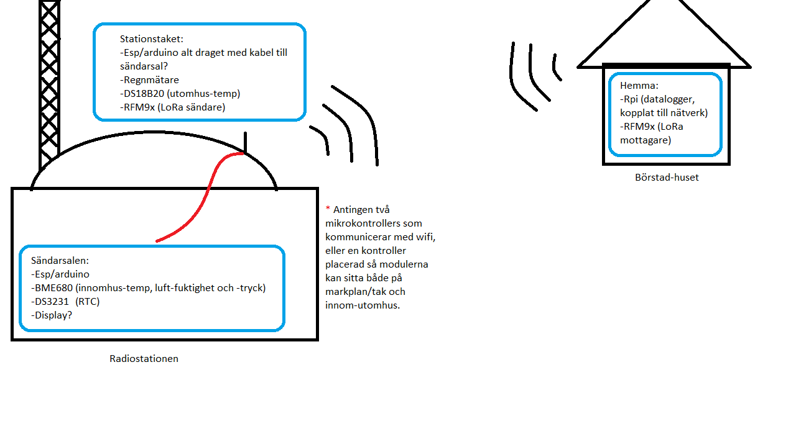

# Väderstation

Git-repo för Klaséns Arduino-baserade väderstation.

Använder just nu sensorerna DS18B20, BME680 och DS3231 för att samla data och RFM9x för att sända den via LoRa.

## Att göra:

* Ordna LoRa sändning/mottagning
* Integrera regnmätaren
* Bestäm hur datan ska formateras och loggas
* Hitta en bra antenn-lösning
* Lös installering i radiostationen

Konceptskiss:

